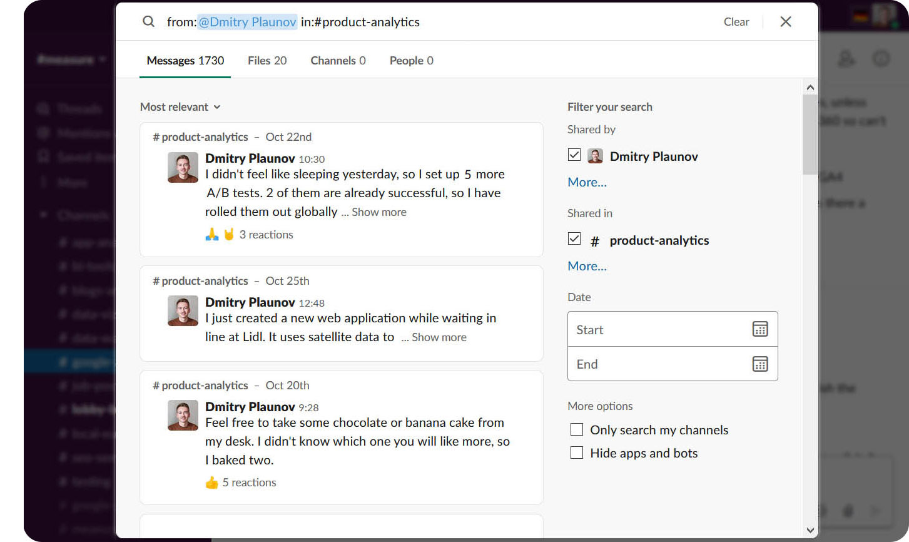

# Unique words of Slack users

With the scripts of this project you can calculate what are the most distinguishing words of each member in your team, getting the data from [Slack](https://slack.com/) messages. It consists of 2 parts:
- a [JavaScript](https://www.w3schools.com/whatis/whatis_js.asp) that scrapes messages on Slack
- a [Python](https://www.python.org/) script that applies a formula to estimate what are the most unique words

Running the scripts returns a CSV file that can be used to create infographics like this:

For this sample infographic all the images were created with [This Person Doesn't Exist](https://thispersondoesnotexist.com/).
All the words under the images are random and don't indicate any specific person.

## Methodology

The following formula was used to estimate how unique the word is to a specific person. The higher the number is, the more unique the word is.

## Requirements

- A Slack account
- Python version 3.3+ to be able to run Python code ([download here](https://www.python.org/downloads/))
- (Optional) [Jupyter Notebook](https://jupyter.org/) to be able to read and modify Python code in a nice interface ([installation guideline here](https://jupyter.readthedocs.io/en/latest/install/notebook-classic.html))

## Status

The scraping part of this project depends on the front-end of the search page on Slack.
If Slack re-organizes the page or renames element identifiers, then the JavaScript might stop working.

Luckily, in 6 months of 2020, only 1 element name was changed, so the script required minimal adjustment.

The last time the script was updated: __October 2020__.

## How to run it

##### Part I. Scraping

As you need to be authenticated to see the messages and often the content doesn't have a specific URL, one of the ways to scrape the messages is by actually opening a browser and letting JavaScript to go through the message history, collect message elements and save them in a TXT file. In this project each user will have a separate TXT file with his/her/their messages.

1. Go to any page of your Slack messages and click on the search bar, which should open the following view:

2. Search for a user whose messages to scrape and a public channel, e.g.:

`from: @Dmitry Plaunov in: #product-analytics`

3. Open the browser's developer console, insert the [JavaScript snippet](part-1-slack-scraping.js) and run the code by clicking `Enter`

4. The script will take 5 seconds per page, and you will see how it is moving through the message history. When it finishes running, you will have all the messages copied to your clipboard. If the messages are not copied, enter `copy(all_messages)` in the console

5. Open a text editor and save the messages in a TXT file in the `team` folder

##### Part II. Analysing data

1. Open the Command Prompt and run `pip install pandas`

2. Run the Python script inside the [Jupyter Notebook file](part-2-slack-analysing.ipynb) or run `python part-2-slack-analysing.py` in the Command Prompt in the repository's root directory

3. When the script finishes running, a CSV file with the words and calculations will be exported to the same folder

## License

[MIT](https://choosealicense.com/licenses/mit/)
